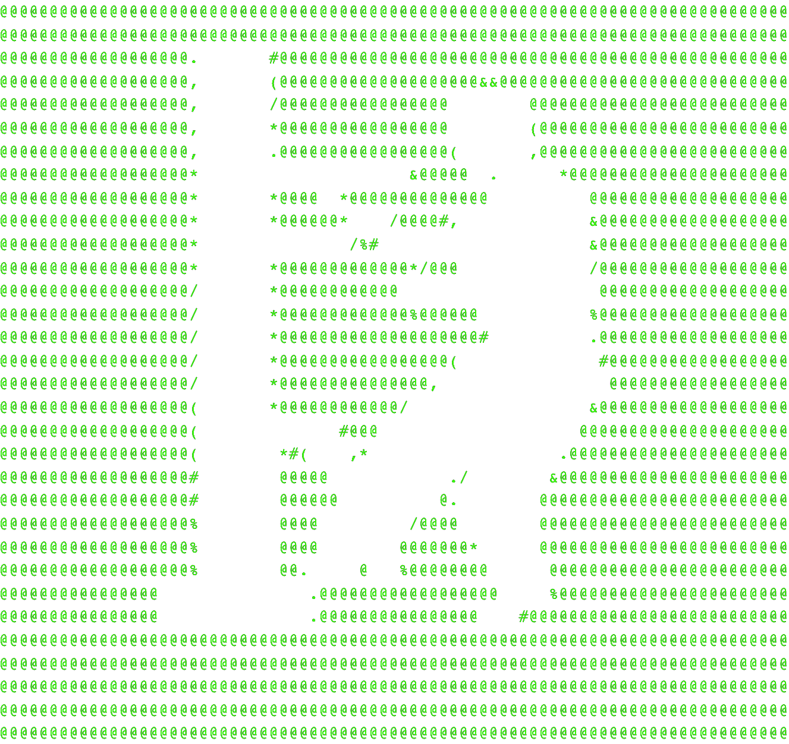

# theDOJO v1.1 




> @title      : theDOJO v1.1

> @author     : stereoIII6

> @coAuthor   : xnode

> @company    : fractio incorporated

> @emails     : aron@fractio.xyz, nmisner@fractio.xyz

> @about      : theDOJO is a vanilla truffe web3 scaffolding setup that allows an easy quick setup for defi projects and dapps. It uses the most basic setup but allow complex projects without overbloated npm libraries noone can keep up to date with all the modern features that other frameworks on npm deliver.

> @devtech    : truffle, solidity, javascript, json, html, css 

## Requirements

> NodeJS@17 & NPM@8

> Git@2

> Trufflle@5

> Firefox or Brave Browser & Metamask Extension

You should be ready to go !

## Installation 

> Install Truffle  ```npm i -g truffle```

> Create a directory ```mkdir ROOT_DIR``` 

> navigate into it ```cd ROOT_DIR``` 

>clone the repo into the directory ```git clone  .```

> Install Repo Dependencys and Node Modules ```npm i```

> fix webpack issues type ```export NODE_OPTIONS=--openssl-legacy-provider``` in root dir

## Initialization

> You will need to open ```.conf_env``` and edit the seedphrase, admin address, and the infura api codes and 

> finally save the file as ```.env``` in the root dir.

> :: CAUTION : make sure not to leave sensitive data in any file but ```.env```. In production these values will have to be hidden server vars. Only use Mumbai Testnetwork until you know what you are doing. Be cautionate about which seedphrase and admin account you intend to use for which project to protect your funds. ::

> Then you will need to compile and migrate the contracts ```npm run migrate:<network>``` you can choose from main, polygon, mumbai, optimism & arbitrum to migrate the contracts onto the wanted chain/s.

## Operation

> Run project in local environment ```npm run dev``` in root directory from terminal.

> You will be kicked to -> ```http://localhost:8080``` automatically.

> If you edit the sourcecode your Server automatically updates the website on save.


## Directory Structure & Important Files

```root
: build // build dir
:: contracts // abi build dir
::: soxiety.json // contract data incl abi

: contract
:: s0xiety.sol // smart contract

: src // source code dir JS
:: app.js // project Source JS (CODE HERE)

: migrations // blockchain migration dir
:: 1_initial_migration.js // migration init
:: 2_deploy_s0x.js // smart contract migration conf

: public // source dir HTML
:: images
::: favicon.png // page favicon
::: logo.png // website logo
:: app.html // source code HTML (CODE HERE)

: package.json // npm config
: package-lock.json
: truffle-config.js // truffle config
: webpack.config.js // webpack config 

: .conf_env // default hidden vars envelope preset
: .env // hidden vars envelope
: .gitignore // git ignore file list
```

## Minimum Dependencies

@metamask/detect-provider
@openzeppelin/contracts
@openzeppelin/test-helpers
@truffle/hdwallet-provider
bignumber
dotenv
ethers
mocha
underscore